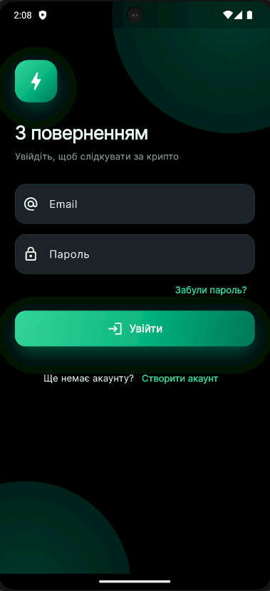
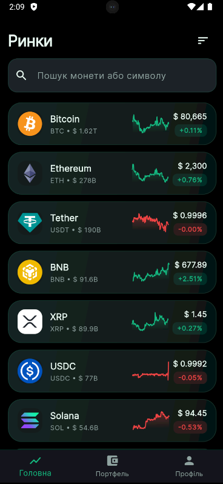
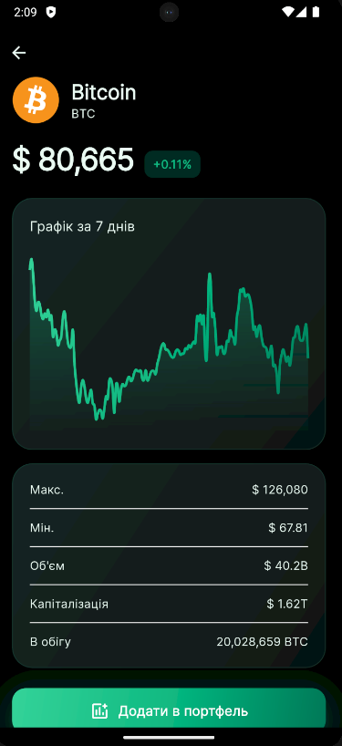
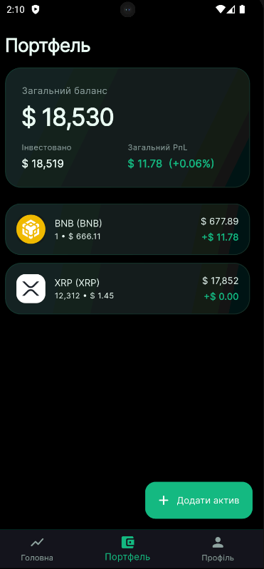
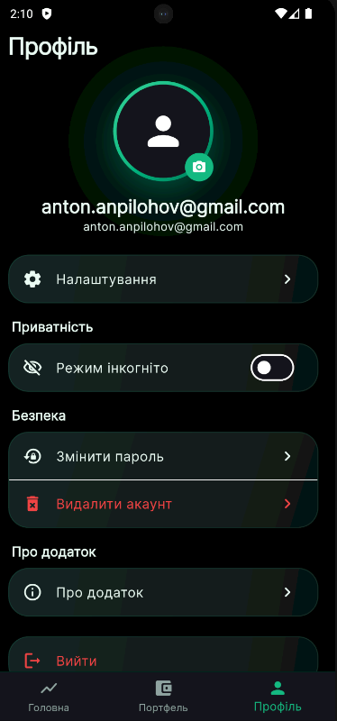
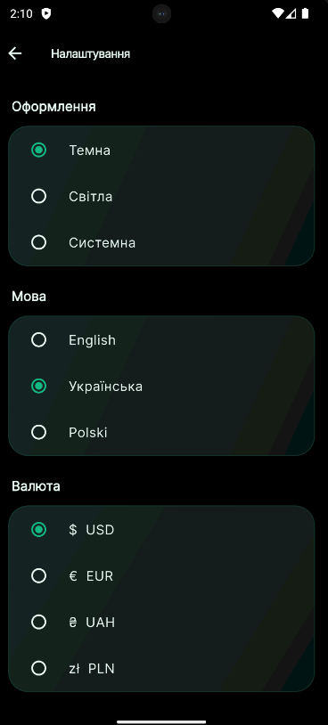

# CryptoTosentai

> Premium fintech crypto portfolio tracker. Track top coins, build a personal portfolio with automatic PnL, and sync everything across devices via your Firebase account.

Built with **Flutter 3.24+ · Dart 3.5+ · Material 3 · Riverpod · GoRouter · Firebase Auth + Firestore · CoinGecko API**.

---

## Опис

CryptoTosentai — мобільний portfolio tracker для крипто-ринку у premium fintech-стилі (натхнення: Binance, Coinbase, TradingView). Користувач реєструється через Firebase Auth, переглядає топ-монет з CoinGecko, додає активи у власний портфель і бачить актуальні PnL у вибраній валюті. Дані синхронізуються через Firestore.

### Ключові фічі

- **Auth** — email/password sign up · sign in · sign out · password reset · change password · delete account (re-auth + повне видалення `users/{uid}`); protected routes через GoRouter `redirect`.
- **Markets** — топ-100 монет з пошуком, сортуванням (cap / price / 24h%), pull-to-refresh, **mini sparkline 7d** на кожній картці, animated change badges, shimmer loading.
- **Coin Details** — Hero animation, 7-day chart (`fl_chart`), ATH / ATL / Volume / Market cap / Circulating supply, кнопка Add to Portfolio.
- **Portfolio** — CRUD активів (amount + buy price + notes), автоматичний PnL по кожному активу і сумарно, animated summary card з `FittedBox`, long-press для видалення.
- **Privacy / режим інкогніто** — toggle у Profile, маскує всі суми (`••••••`); tap по summary card тимчасово розкриває цифри і ховає назад.
- **Profile-хаб** — аватар (камера / галерея), display name (sync з Firestore), Settings · Privacy · Security · About · Sign out.
- **Settings** — Dark / Light / System тема, мова (EN / UK / PL), валюта (USD / EUR / UAH / PLN). Зміна валюти автоматично перезапитує API і оновлює всі ціни в додатку.
- **About** — версія додатку (`package_info_plus`), open-source licenses (`showLicensePage`), Terms / Privacy / Source code (відкриваються через `url_launcher`).
- **Cloud sync** — portfolio + settings + hideBalances + displayName живуть у Firestore під `users/{uid}`.
- **Offline** — останній HTTP-response монет кешується у SharedPreferences (TTL 2 хв), при втраті мережі відмальовуються кешовані ціни.
- **Локалізація** — 3 мови через `intl` + `arb`.

### Технології

- **State:** Riverpod (`StateNotifier`, `FutureProvider`, `StreamProvider`, `Provider.family`).
- **Routing:** GoRouter з `redirect` для protected routes і `ShellRoute` для tab-bar навігації.
- **HTTP:** Dio з кастомним `x-cg-demo-api-key` header, кеш у `CoinRepositoryImpl`.
- **Firebase:** `firebase_core`, `firebase_auth`, `cloud_firestore`.
- **Local cache:** `shared_preferences` для миттєвого старту (theme/locale/currency/hideBalances) і offline-fallback.
- **UI:** `google_fonts` (Inter), `fl_chart`, `CustomPainter` sparkline, `shimmer`, `cached_network_image`, `image_picker`.
- **Misc:** `package_info_plus`, `url_launcher`, `intl`.

### Архітектура

**Clean Architecture + Feature First.** Кожна фіча — самодостатній модуль з трьома шарами (`data` / `domain` / `presentation`). Domain-шар не знає про конкретні реалізації — тільки інтерфейси.

```
lib/
├── main.dart                ← Firebase init + ProviderScope
├── firebase_options.dart    ← згенеровано flutterfire CLI
├── app/                     ← MaterialApp, GoRouter, AppShell
├── core/                    ← cross-cutting: theme, network, storage, widgets, utils, constants
├── l10n/                    ← .arb файли + згенерований AppLocalizations
├── shared/providers/        ← cross-feature провайдери (settings, currency, dio, firestore)
└── features/
    ├── auth/                ← Firebase Auth + UI
    ├── home/                ← Markets list з CoinGecko
    ├── details/             ← Coin Details з графіком
    ├── portfolio/           ← Firestore CRUD + PnL
    ├── profile/             ← Аватар, displayName, profile-хаб
    └── settings/            ← Theme/locale/currency + Firestore sync
```

---

## Скріншоти


| Login | Markets | Coin Details |
|---|---|---|
|  |  |  |

| Portfolio | Profile | Settings |
|---|---|---|
|  |  |  |

---

## Запуск

### Передумови

- Flutter SDK **3.24+** (`flutter --version`)
- Android Studio або Xcode
- Firebase-проект (Spark plan безкоштовний — вистачає)

### 1. Клон і залежності

```bash
git clone <this-repo>
cd CryptoTosentai
flutter pub get
flutter gen-l10n
```

### 2. Firebase

> ⚠️ **`lib/firebase_options.dart` НЕ комітиться** (додано до `.gitignore` разом з `google-services.json` і `GoogleService-Info.plist`). Кожен розробник генерує власну конфігурацію під свій Firebase-проект.

Згенеруй свою:

```bash
dart pub global activate flutterfire_cli
flutterfire configure
```

CLI створить Firebase app, **створить локальний** `lib/firebase_options.dart` і додасть `google-services.json` (Android) / `GoogleService-Info.plist` (iOS) — без цих файлів додаток не запуститься (буде `Firebase init skipped` у консолі і Auth не працюватиме).

### 3. У Firebase Console

1. **Authentication → Sign-in method** → увімкнути **Email/Password**.
2. **Firestore Database** → Create database (будь-який регіон, Spark plan безкоштовний).
3. **Firestore → Rules** → застосувати:

   ```js
   rules_version = '2';
   service cloud.firestore {
     match /databases/{database}/documents {
       match /users/{uid}/{document=**} {
         allow read, write: if request.auth != null && request.auth.uid == uid;
       }
     }
   }
   ```

   Кожен юзер має доступ тільки до власного `users/{uid}` піддерева.


### 4. Permissions

Уже додано в проект — це для довідки.

#### Android — [AndroidManifest.xml](android/app/src/main/AndroidManifest.xml)

```xml
<uses-permission android:name="android.permission.INTERNET" />
<uses-permission android:name="android.permission.ACCESS_NETWORK_STATE" />
<uses-permission android:name="android.permission.CAMERA" />
<uses-permission android:name="android.permission.READ_MEDIA_IMAGES" />
<uses-permission android:name="android.permission.READ_EXTERNAL_STORAGE"
    android:maxSdkVersion="32" />
<uses-feature android:name="android.hardware.camera" android:required="false" />
```

#### iOS — [Info.plist](ios/Runner/Info.plist)

```xml
<key>NSCameraUsageDescription</key>
<string>CryptoTosentai needs camera access to take a profile avatar photo.</string>
<key>NSPhotoLibraryUsageDescription</key>
<string>CryptoTosentai needs photo library access to choose a profile avatar.</string>
```

### 5. Команди

```bash
# Розробка
flutter run                       # debug build
flutter analyze                   # лінтер (повинен бути 0 issues)
flutter test                      # тести (24/24 passed)
flutter gen-l10n                  # перегенерувати локалізацію після зміни .arb

# Релізні білди
flutter build apk --release       # Android APK
flutter build appbundle --release # Android App Bundle (Play Store)
flutter build ios --release       # iOS (потребує Xcode)
flutter build web --release       # Web

# Очистка
flutter clean && flutter pub get
```

---

## Зовнішні API та посилання

### CoinGecko

- Base URL: `https://api.coingecko.com/api/v3`
- Header: `x-cg-demo-api-key`

> ⚠️ У [api_constants.dart](lib/core/constants/api_constants.dart) лежить **placeholder** demo-ключ. Зареєструйся на [coingecko.com/en/developers/dashboard](https://www.coingecko.com/en/developers/dashboard), згенеруй свій demo key і встав у поле `apiKey`. Ключ безкоштовний, але має ліміт ~30 запитів/хв.

```dart
// lib/core/constants/api_constants.dart
static const String apiKey = 'CG-yourOwnKeyHere';
```
---

## Обмеження

- **CoinGecko demo key** — ~30 запитів/хв, не для production-навантаження.
- **Firebase Storage не використовується** — аватар per-device, на іншому пристрої не перенесеться.
- **Web build** — `image_picker` на web обмежений (тільки галерея, не камера).
